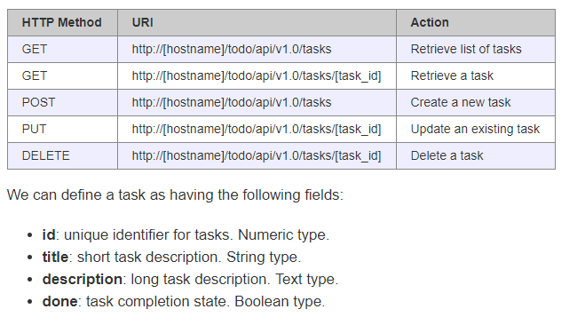

# python_flask_simple_api_post
python_flask_simple_api_post

> http://[hostname]/todo/api/v1.0/

http://localhost:5000/todo/api/v1.0/tasks

http://localhost:5000/todo/api/v1.0/tasks/2

## Docs

https://blog.miguelgrinberg.com/post/designing-a-restful-api-with-python-and-flask

https://stackoverflow.com/questions/22947905/flask-example-with-post